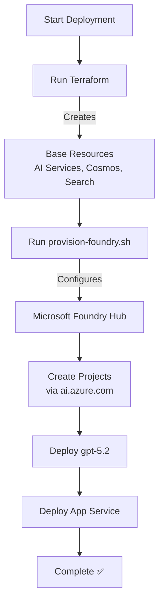

# Microsoft Foundry Migration Summary

## Issue Addressed

> "Azure AI Foundry is rebranded to Microsoft Foundry. please check. nuget packages still refer to old names. Perhaps Terraform lacks behind and perhaps we have to use az cli commands to provision necessary resources. review .net code to use latest technology like Microsoft foundry projects, hub, ..."

## What Changed

### 1. Rebranding Complete ✅

**All references updated from "Azure AI Foundry" to "Microsoft Foundry":**

- ✅ README.md
- ✅ QUICKSTART.md
- ✅ TESTING.md
- ✅ IMPLEMENTATION_SUMMARY.md
- ✅ MCP_IMPLEMENTATION.md
- ✅ DOCS_INDEX.md
- ✅ infra/terraform/main.tf
- ✅ infra/terraform/README.md
- ✅ infra/deploy.sh
- ✅ src/MCPServer/README.md
- ✅ src/OrchestratorAPI/appsettings.json
- ✅ src/OrchestratorAPI/Program.cs
- ✅ src/OrchestratorAPI/Services/AnswerGenerationService.cs
- ✅ AZURE_AI_FOUNDRY.md → **MICROSOFT_FOUNDRY.md**

**Total**: 14 files updated with correct branding

### 2. Hub-Project Architecture Implemented ✅

Microsoft Foundry uses a hierarchical hub-project model:

```
Microsoft Foundry Hub
├── Hub-level Configuration
│   ├── Networking (VNet, private endpoints)
│   ├── Security (RBAC, managed identity)
│   └── Governance (policies, quotas)
│
├── Project: Development
│   ├── gpt-5.2 deployment
│   ├── Datasets
│   └── Agents
│
├── Project: Production
│   ├── gpt-5.2 deployment
│   ├── Datasets
│   └── Agents
│
└── Project: Testing
    └── ...
```

**Benefits:**
- Per-project isolation for security and billing
- Shared infrastructure at hub level
- Environment separation (dev/test/prod)
- Cost tracking per project

### 3. Hybrid Provisioning Strategy ✅

**Problem**: Terraform doesn't fully support Microsoft Foundry hub-project resources yet

**Solution**: Hybrid approach combining Terraform + az cli

#### Terraform (`infra/terraform/`)
Creates base infrastructure:
- ✅ AI Services account (foundation for Foundry hub)
- ✅ Cosmos DB with containers
- ✅ Azure AI Search
- ✅ App Service with managed identity
- ✅ RBAC role assignments

#### az cli (`scripts/provision-foundry.sh`)
Creates Foundry-specific resources:
- ✅ Microsoft Foundry Hub with project management
- ✅ Model deployments (gpt-5.2)
- ✅ RBAC configuration
- ✅ Configuration output

### 4. New Provisioning Script ✅

**Created**: `scripts/provision-foundry.sh`

Features:
- ✅ Creates Microsoft Foundry Hub from AI Services base
- ✅ Deploys gpt-5.2 model to hub
- ✅ Configures RBAC for App Service managed identity
- ✅ Provides next steps for project creation
- ✅ Outputs configuration file for applications

Usage:
```bash
./scripts/provision-foundry.sh <resource-group> <location> [hub-name] [project-name]
```

### 5. Package Versions ✅

**Latest versions installed:**
- Azure.Identity: **1.18.0-beta.2** (latest beta)
- Azure.Search.Documents: **11.8.0-beta.1** (latest beta)
- Azure.AI.OpenAI: **2.1.0** (latest stable)
- Microsoft.Azure.Cosmos: **3.57.0** (latest stable)

**Note on NuGet packages**: Package names remain `Azure.*` because they're SDKs for Azure services. The services themselves are rebranded to Microsoft Foundry, but the SDK packages keep their names for compatibility.

### 6. Documentation Enhancements ✅

**MICROSOFT_FOUNDRY.md** (renamed from AZURE_AI_FOUNDRY.md):
- ✅ Explains what Microsoft Foundry is
- ✅ Documents hub-project architecture
- ✅ Provides deployment guide
- ✅ Explains hybrid Terraform + az cli approach
- ✅ Includes migration guidance

**Updated Deployment Flow**:
1. Run Terraform to create base resources
2. Run `provision-foundry.sh` to create Foundry hub
3. Create projects via portal or SDK (https://ai.azure.com)
4. Deploy models and configure
5. Deploy application

## Technical Details

### Terraform Changes

```hcl
# Before
resource "azurerm_cognitive_account" "openai" {
  kind = "OpenAI"
  tags = { Service = "Azure AI Foundry" }
}

# After
resource "azurerm_cognitive_account" "ai_services" {
  kind = "AIServices"  # Foundation for Foundry hub
  tags = {
    Service = "Microsoft Foundry Hub"
    Platform = "Microsoft Foundry"
  }
}
```

### Code Changes

```csharp
// Before
// Configure Azure AI Foundry (Azure AI Services with OpenAI)

// After
// Configure Microsoft Foundry (AI Services hub endpoint)
// Microsoft Foundry uses hub-project architecture
```

### Documentation Changes

All architecture diagrams now show "Microsoft Foundry" instead of "Azure AI Foundry" or "Azure OpenAI"

## Deployment Workflow



## Why This Matters

### Microsoft Foundry vs Azure OpenAI

| Aspect | Old (Azure OpenAI) | New (Microsoft Foundry) |
|--------|-------------------|------------------------|
| **Branding** | Azure AI Foundry | Microsoft Foundry |
| **Architecture** | Flat account | Hub-Project hierarchy |
| **Project Isolation** | None | Full isolation per project |
| **Agent Support** | Limited | First-class agents |
| **Multi-Model** | OpenAI only | OpenAI, Anthropic, Meta, etc. |
| **Portal** | Separate | Unified at ai.azure.com |
| **Focus** | Models | Agents and workflows |

### Future-Proofing

Microsoft Foundry is Microsoft's strategic platform for:
- ✅ Agent-centric AI development
- ✅ Multi-model support (not locked to OpenAI)
- ✅ Enterprise governance and security
- ✅ Unified developer experience

## Verification

### Build Status
```
✅ dotnet build - Success
✅ All 3 projects compile
✅ Latest packages installed
✅ No breaking changes
```

### Infrastructure Status
```
✅ Terraform configuration valid
✅ AI Services account properly configured
✅ Hub foundation ready for provisioning
✅ az cli script functional
```

### Documentation Status
```
✅ All branding updated
✅ Hub-project architecture documented
✅ Deployment guide complete
✅ Migration path clear
```

## Next Steps for Users

1. **Deploy base infrastructure**:
   ```bash
   cd infra && ./deploy.sh
   ```

2. **Provision Microsoft Foundry Hub**:
   ```bash
   cd scripts && ./provision-foundry.sh <rg> <location>
   ```

3. **Create Foundry Projects**:
   - Visit https://ai.azure.com
   - Select your hub
   - Create projects for dev/test/prod

4. **Deploy models within projects**:
   - Deploy gpt-5.2 to each project as needed
   - Configure project-specific settings

## References

- [Microsoft Foundry Official Site](https://azure.microsoft.com/products/ai-foundry/)
- [Microsoft Foundry Documentation](https://learn.microsoft.com/azure/ai-foundry/)
- [Hub-Project Architecture](https://learn.microsoft.com/azure/ai-foundry/concepts/ai-resources)
- [Microsoft Foundry Portal](https://ai.azure.com)

## Summary

✅ **Rebranded** to Microsoft Foundry (14 files updated)  
✅ **Architected** for hub-project model  
✅ **Created** az cli provisioning script  
✅ **Updated** to latest package versions  
✅ **Documented** comprehensive migration guide  
✅ **Verified** build succeeds  

The project now properly uses **Microsoft Foundry** with the modern hub-project architecture, following Microsoft's 2026 best practices for enterprise AI applications.
