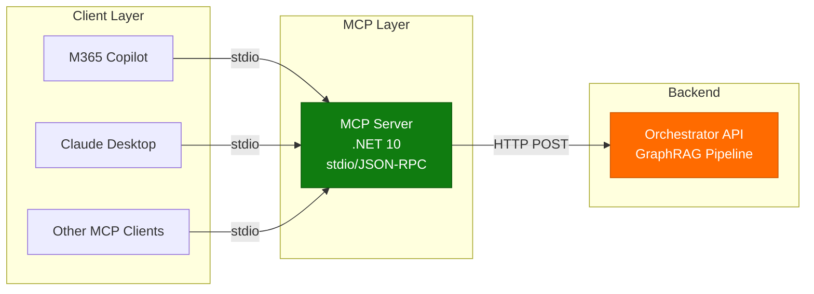
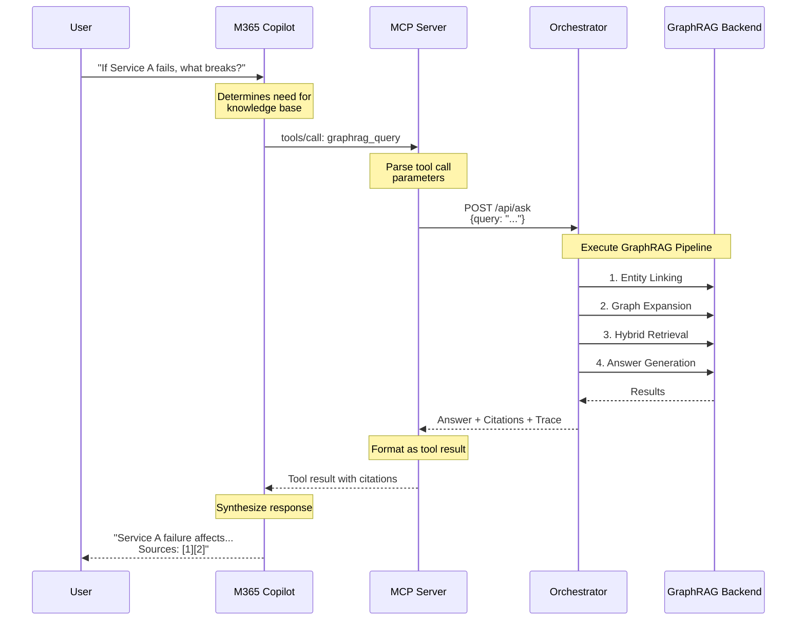
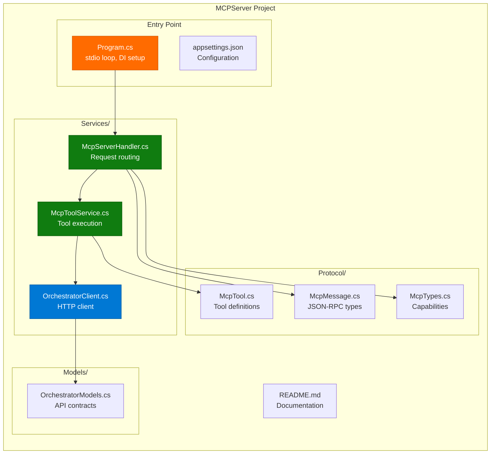

# MCP Server Implementation Summary

> **📊 Viewing Diagrams**: This documentation includes interactive Mermaid diagrams. View on [GitHub](https://github.com/sujithq/microsoft-copilot-demo) to see rendered diagrams.

## Overview

Successfully implemented a Model Context Protocol (MCP) server that enables Microsoft 365 Copilot to access the GraphRAG knowledge base through standardized tools.

## Architecture



## What Was Built

### MCP Server (`src/MCPServer/`)

A .NET 10 console application that:
- Implements the Model Context Protocol specification
- Provides JSON-RPC 2.0 communication over stdio
- Exposes 3 GraphRAG tools to M365 Copilot
- Acts as a bridge between MCP clients and the Orchestrator API

### Key Components

#### 1. Protocol Layer (`Protocol/`)

- **McpMessage.cs**: JSON-RPC message types (Request, Response, Notification, Error)
- **McpTool.cs**: Tool definitions with input schemas
- **McpTypes.cs**: Server capabilities and initialization types

#### 2. Services Layer (`Services/`)

- **OrchestratorClient.cs**: HTTP client for calling Orchestrator API
  - `AskAsync()`: Full GraphRAG query
  - `GetEntityInfoAsync()`: Entity lookup
  - `ExpandGraphAsync()`: Graph expansion

- **McpToolService.cs**: Tool implementations and execution
  - Defines 3 tools with JSON schemas
  - Handles tool parameter parsing
  - Executes tool logic and formats responses

- **McpServerHandler.cs**: JSON-RPC request routing
  - Handles `initialize`, `tools/list`, `tools/call`, `ping` methods
  - Manages server state
  - Error handling and response formatting

#### 3. Program.cs

- Stdio-based server (reads from stdin, writes to stdout)
- Dependency injection setup
- JSON-RPC message loop
- Logging and error handling

## Available Tools

### 1. graphrag_query

**Description**: Query the GraphRAG knowledge base using the full pipeline

**Parameters**:
- `query` (required): The question to ask
- `user_id` (optional): User identifier
- `conversation_id` (optional): Conversation context

**Output**: Answer with citations and trace information

**Example**:
```json
{
  "name": "graphrag_query",
  "arguments": {
    "query": "If Service A fails, what breaks and who owns escalation?"
  }
}
```

### 2. entity_lookup

**Description**: Get detailed information about a specific entity

**Parameters**:
- `entity_id` (required): Entity identifier (e.g., "service-a")

**Output**: Entity description and related information

**Example**:
```json
{
  "name": "entity_lookup",
  "arguments": {
    "entity_id": "service-a"
  }
}
```

### 3. graph_expansion

**Description**: Discover related entities and relationships from a starting point

**Parameters**:
- `entity_id` (required): Starting entity
- `hops` (optional): Number of relationship hops (1-3, default: 1)

**Output**: List of related entities and their relationships

**Example**:
```json
{
  "name": "graph_expansion",
  "arguments": {
    "entity_id": "service-a",
    "hops": 2
  }
}
```

## Communication Protocol

### JSON-RPC 2.0 Format

**Request**:
```json
{
  "jsonrpc": "2.0",
  "id": "unique-id",
  "method": "method-name",
  "params": {...}
}
```

**Success Response**:
```json
{
  "jsonrpc": "2.0",
  "id": "unique-id",
  "result": {...}
}
```

**Error Response**:
```json
{
  "jsonrpc": "2.0",
  "id": "unique-id",
  "error": {
    "code": -32603,
    "message": "Error description"
  }
}
```

### Supported Methods

1. **initialize**: Initialize server and get capabilities
2. **tools/list**: Get available tools
3. **tools/call**: Execute a tool
4. **ping**: Health check

## Configuration

### appsettings.json

```json
{
  "OrchestratorApi": {
    "BaseUrl": "http://localhost:5000"
  }
}
```

### Environment Variables

```bash
export OrchestratorApi__BaseUrl="https://your-orchestrator.azurewebsites.net"
```

## Integration with M365 Copilot

### Setup

1. Configure MCP client (e.g., Claude Desktop):

```json
{
  "mcpServers": {
    "graphrag": {
      "command": "dotnet",
      "args": ["run", "--project", "/path/to/src/MCPServer"],
      "env": {
        "OrchestratorApi__BaseUrl": "https://your-orchestrator.azurewebsites.net"
      }
    }
  }
}
```

2. Client automatically starts server and connects via stdio
3. Tools become available to the AI assistant

### Usage Flow



### Usage Examples

**User asks Copilot**: "If Service A fails, what breaks?"

**Behind the scenes**:
1. M365 Copilot determines it needs knowledge base access
2. Calls `graphrag_query` tool via MCP
3. MCP Server calls Orchestrator API
4. Orchestrator executes GraphRAG pipeline
5. Response flows back through MCP to Copilot
6. Copilot presents answer to user

## Benefits of MCP Integration

1. **Standardization**: MCP is an open protocol, enabling broader ecosystem compatibility
2. **Tool Discovery**: Tools are self-describing with JSON schemas
3. **Flexibility**: Can be used by any MCP-compatible client
4. **Security**: Stdio communication keeps server local and secure
5. **Simplicity**: No web server or authentication complexity

## Files Created



Directory structure:
```
src/MCPServer/
├── MCPServer.csproj              # Project file
├── Program.cs                    # Main entry point
├── appsettings.json              # Configuration
├── README.md                     # Comprehensive documentation
├── Models/
│   └── OrchestratorModels.cs    # Data models
├── Protocol/
│   ├── McpMessage.cs             # JSON-RPC types
│   ├── McpTool.cs                # Tool definitions
│   └── McpTypes.cs               # Protocol types
└── Services/
    ├── OrchestratorClient.cs     # HTTP client
    ├── McpToolService.cs         # Tool implementations
    └── McpServerHandler.cs       # Request handler
```

## Documentation Updates

1. **README.md**: Added MCP Server to architecture diagram
2. **QUICKSTART.md**: Added MCP testing steps and configuration
3. **TESTING.md**: Added MCP server testing section
4. **MCP_CONFIG.md**: Comprehensive configuration examples
5. **src/MCPServer/README.md**: Detailed MCP server documentation
6. **scripts/test-mcp-server.sh**: Test script

## Testing

### Build Verification
```bash
dotnet build  # ✅ Build succeeded
```

### Manual Testing
```bash
# Initialize
echo '{"jsonrpc":"2.0","id":"1","method":"initialize","params":{}}' | \
  dotnet run --project src/MCPServer

# List Tools
echo '{"jsonrpc":"2.0","id":"2","method":"tools/list","params":{}}' | \
  dotnet run --project src/MCPServer

# Call Tool (requires Orchestrator running)
echo '{"jsonrpc":"2.0","id":"3","method":"tools/call","params":{"name":"graphrag_query","arguments":{"query":"What is Service A?"}}}' | \
  dotnet run --project src/MCPServer
```

## Integration Options Comparison

| Feature | Copilot Agent | MCP Server |
|---------|---------------|------------|
| Protocol | Bot Framework | MCP (JSON-RPC) |
| Communication | HTTP | stdio |
| Discovery | Manual | Tool schemas |
| Integration | M365-specific | MCP-compatible clients |
| Complexity | Medium | Low |
| Security | Azure AD | Local process |

## Future Enhancements

Possible improvements:
1. Add more specialized tools (e.g., batch queries, analytics)
2. Implement resource subscriptions for real-time updates
3. Add caching layer for frequent queries
4. Support for streaming responses
5. Enhanced error recovery and retry logic
6. Telemetry and usage analytics

## Conclusion

The MCP Server successfully provides a standardized, protocol-based interface for M365 Copilot to access the GraphRAG knowledge base. It complements the existing Copilot Agent by offering an alternative integration path that leverages the open Model Context Protocol.

Users can now choose between:
- **Direct integration** via Copilot Agent (Bot Framework)
- **MCP integration** for broader compatibility and standardization

Both approaches use the same Orchestrator API backend, ensuring consistency in functionality and behavior.
