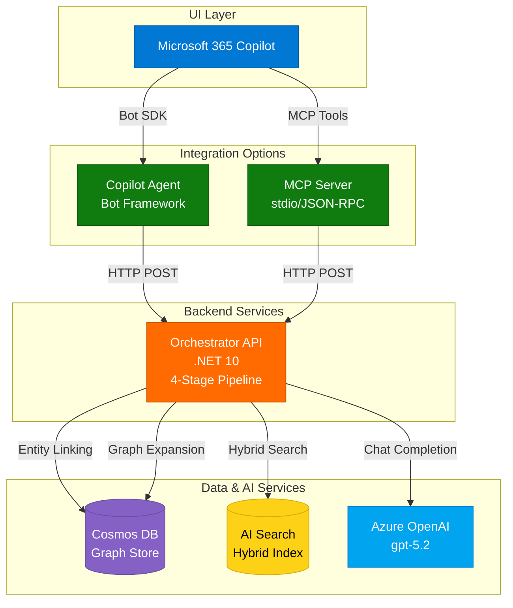

# Quick Start Guide

Get the GraphRAG demo running in 15 minutes.

## Prerequisites

- ✅ .NET 10 SDK installed
- ✅ Azure CLI installed and logged in (`az login`)
- ✅ Terraform >= 1.0 installed
- ✅ Azure subscription with appropriate permissions

## Integration Options

This demo provides **two ways** to integrate with Microsoft 365 Copilot:

1. **Copilot Agent** (Bot Framework): Direct integration using Microsoft 365 Agents SDK
2. **MCP Server** (Model Context Protocol): Standardized tool interface for M365 Copilot

Choose the integration that best fits your needs. Both use the same Orchestrator API backend.

## Step 1: Clone and Build (2 minutes)

```bash
git clone https://github.com/sujithq/microsoft-copilot-demo.git
cd microsoft-copilot-demo
dotnet build
```

## Step 2: Deploy Infrastructure with Terraform (5 minutes)

```bash
cd infra
./deploy.sh dev eastus mycompany
```

This creates:
- Resource Group
- Cosmos DB with database and containers
- Azure AI Search service
- Azure OpenAI account
- App Service with Managed Identity

Save the output endpoints for the next steps.

## Step 3: Deploy Azure OpenAI Model (3 minutes)

```bash
# Get the OpenAI account name from deployment output
OPENAI_ACCOUNT="<from-output>"
RESOURCE_GROUP="<from-output>"

az cognitiveservices account deployment create \
  --name $OPENAI_ACCOUNT \
  --resource-group $RESOURCE_GROUP \
  --deployment-name gpt-5.2 \
  --model-name gpt-5.2 \
  --model-version latest \
  --model-format OpenAI \
  --sku-capacity 10 \
  --sku-name Standard
```

## Step 4: Create Search Index (2 minutes)

```bash
cd ../scripts

# Get search endpoint and key from Terraform outputs
cd ../infra/terraform
SEARCH_ENDPOINT=$(terraform output -raw search_endpoint)
SEARCH_KEY=$(terraform output -raw search_primary_key)

cd ../../scripts

curl -X PUT \
  "$SEARCH_ENDPOINT/indexes/chunks?api-version=2024-07-01" \
  -H "Content-Type: application/json" \
  -H "api-key: $SEARCH_KEY" \
  -d @search-index-schema.json
```

## Step 5: Load Sample Data (3 minutes)

### Option A: Using Azure CLI and curl

```bash
# Get Cosmos connection details
cd ../infra/terraform
COSMOS_ENDPOINT=$(terraform output -raw cosmos_endpoint)
COSMOS_KEY=$(terraform output -raw cosmos_primary_key)

# Upload to Cosmos DB (you may need a data migration tool)
# For quick testing, you can use the Azure Portal Data Explorer
```

**Quick method via Azure Portal:**
1. Open Azure Portal
2. Navigate to your Cosmos DB account
3. Go to Data Explorer
4. Select `graphrag` database
5. For each container (entities, relations, chunks):
   - Click "Items"
   - Click "Upload Item"
   - Upload the corresponding JSON file from `scripts/sample-data/`

### Option B: Use Docker for local testing

```bash
# Run locally with Docker (uses your Azure resources)
cd ../..
docker-compose up
```

## Step 6: Deploy Application (5 minutes)

```bash
cd src/OrchestratorAPI
dotnet publish -c Release -o ./publish

cd ../../infra/terraform
APP_NAME=$(terraform output -raw app_service_name)
RESOURCE_GROUP=$(terraform output -raw resource_group_name)

cd ../../src/OrchestratorAPI
zip -r publish.zip publish/

az webapp deploy \
  --resource-group $RESOURCE_GROUP \
  --name $APP_NAME \
  --src-path publish.zip \
  --type zip
```

## Step 7: Test the API

```bash
# Get the app URL
cd ../../infra/terraform
APP_URL=$(terraform output -raw app_service_url)

# Test health endpoint
curl $APP_URL/api/health

# Test ask endpoint (after data is loaded)
curl -X POST $APP_URL/api/ask \
  -H "Content-Type: application/json" \
  -d '{
    "user": {"aadObjectId": "test-user"},
    "conversationId": "test-123",
    "query": "If Service A fails, what breaks and who owns escalation?",
    "context": {"tenantId": "test", "locale": "en-US"}
  }'
```

## Step 8: Test the MCP Server (Optional)

The MCP Server provides a standardized tool interface for M365 Copilot.

### Run the MCP Server

```bash
cd ../../src/MCPServer

# Configure the Orchestrator URL
export OrchestratorApi__BaseUrl="http://localhost:5000"

# Start the MCP server
dotnet run
```

The server communicates via JSON-RPC over stdio (reads from stdin, writes to stdout).

### Test with JSON-RPC Messages

In another terminal:

```bash
# Initialize the server
echo '{"jsonrpc":"2.0","id":"1","method":"initialize","params":{}}' | \
  dotnet run --project src/MCPServer

# List available tools
echo '{"jsonrpc":"2.0","id":"2","method":"tools/list","params":{}}' | \
  dotnet run --project src/MCPServer

# Call the graphrag_query tool
echo '{"jsonrpc":"2.0","id":"3","method":"tools/call","params":{"name":"graphrag_query","arguments":{"query":"What is Service A?"}}}' | \
  dotnet run --project src/MCPServer
```

### Use the Test Script

```bash
./scripts/test-mcp-server.sh
```

## Integration with M365 Copilot

### Option 1: Using Copilot Agent

Deploy the Copilot Agent from `src/CopilotAgent/` to connect via Bot Framework. See main README for details.

### Option 2: Using MCP Server

Configure M365 Copilot to use the MCP Server:

1. Add to your MCP configuration:
```json
{
  "mcpServers": {
    "graphrag": {
      "command": "dotnet",
      "args": ["run", "--project", "/path/to/src/MCPServer"],
      "env": {
        "OrchestratorApi__BaseUrl": "https://your-orchestrator.azurewebsites.net"
      }
    }
  }
}
```

2. M365 Copilot can now use the GraphRAG tools:
   - `graphrag_query`: Ask questions with full GraphRAG pipeline
   - `entity_lookup`: Get entity information
   - `graph_expansion`: Discover relationships

See `src/MCPServer/README.md` for detailed MCP server documentation.

## Expected Response

```json
{
  "answer": "If Service A fails, escalation should go to Team Y. They can be reached at team-y@example.com or through the on-call rotation at +1-555-0100. Service A depends on Process X, so when Service A fails, any operations that rely on Process X will also be affected.",
  "citations": [
    {
      "title": "Service A Runbook - Escalation Procedures",
      "url": "https://docs.example.com/services/service-a/runbook#escalation",
      "chunkId": "doc1#chunk2"
    },
    {
      "title": "Service A Architecture Documentation",
      "url": "https://docs.example.com/services/service-a/architecture",
      "chunkId": "doc1#chunk1"
    }
  ],
  "trace": {
    "linkedEntities": ["service-a"],
    "expandedEntityIds": ["service-a", "process-x", "team-y"],
    "searchFilter": "entityIds/any(e: e eq 'service-a' or e eq 'process-x' or e eq 'team-y')"
  }
}
```

## Architecture Overview



### Integration Paths

**Option 1: Copilot Agent (Bot Framework)**
- Direct M365 integration
- Uses Bot Framework SDK
- Suitable for enterprise deployments

**Option 2: MCP Server (Model Context Protocol)**
- Standardized tool interface
- Works with any MCP client
- Ideal for multi-client scenarios

## Next Steps

1. **Integrate with Microsoft 365 Copilot**: See main README.md for Copilot Agent setup
2. **Load Your Own Data**: Replace sample data with your organization's documents
3. **Customize the Workflow**: Modify services in `src/OrchestratorAPI/Services/`
4. **Add Monitoring**: Configure Application Insights
5. **Scale for Production**: Upgrade SKUs and add redundancy

## Troubleshooting

### Build fails
```bash
dotnet restore
dotnet clean
dotnet build
```

### Terraform fails
```bash
cd infra/terraform
terraform init -upgrade
terraform plan
```

### API returns errors
- Check Azure resource connectivity
- Verify Managed Identity permissions
- Review App Service logs: `az webapp log tail --name $APP_NAME --resource-group $RESOURCE_GROUP`

## Cost Estimate

Running this demo:
- **Development**: ~$50-100/month
- **Production**: ~$200-500/month (depending on usage)

Main costs:
- Azure OpenAI: Pay per token (gpt-5.2)
- Cosmos DB: $24/month (400 RU/s shared)
- AI Search: $75/month (Basic tier)
- App Service: $13/month (B1 tier)

## Support

- 📖 Documentation: See README.md, TESTING.md, and infra/terraform/README.md
- 🐛 Issues: Open on GitHub
- 💡 Questions: Check scripts/README.md for data seeding help

## Clean Up

To delete all resources:

```bash
cd infra/terraform
terraform destroy
```

Type `yes` when prompted. This removes all Azure resources and stops billing.
