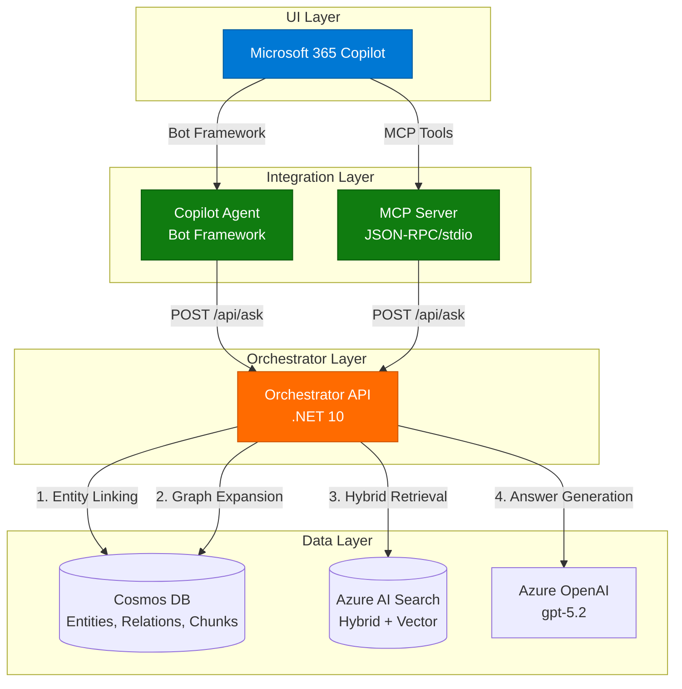
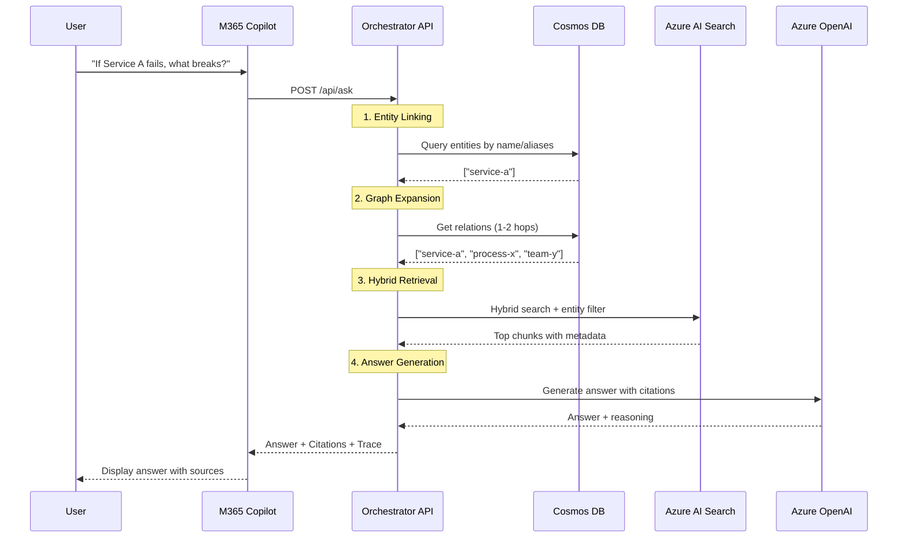

# Microsoft Copilot GraphRAG Demo

This repository implements a headless, code-first GraphRAG architecture for Microsoft 365 Copilot, using .NET 10.

> **📊 Viewing Diagrams**: This documentation includes interactive Mermaid diagrams. View this file on [GitHub](https://github.com/sujithq/microsoft-copilot-demo) to see rendered diagrams. If viewing locally, use a Mermaid-compatible markdown viewer or the [Mermaid Live Editor](https://mermaid.live).

## Architecture



### UI Layer (Only)
- **Microsoft 365 Copilot** → Custom Engine Agent (code-first, Microsoft 365 Agents SDK)
- **Microsoft 365 Copilot** → MCP Server → Orchestrator API (alternative integration path)

### Headless Backend
1. **MCP Server** (Model Context Protocol, .NET 10) - NEW!
   - Provides standardized tool interface for M365 Copilot
   - Exposes GraphRAG capabilities through MCP tools
   - Communicates via JSON-RPC over stdio
2. **Orchestrator API** (Microsoft Agent Framework, .NET 10)
   - Owns the workflow: GraphExpand → Retrieve → Answer
3. **Cosmos DB** (NoSQL)
   - Stores entities, relations, and chunks (system of record + graph layer)
4. **Azure AI Search**
   - Serving index for chunk retrieval (hybrid + vector)
5. **Azure AI Foundry**
   - Model endpoint(s): embeddings + chat completion (no UI)

## Request/Response Flow

### 1. Copilot Agent → Orchestrator

```http
POST /api/ask
Content-Type: application/json

{
  "user": { "aadObjectId": "..." },
  "conversationId": "...",
  "query": "If Service A fails, what breaks and who owns escalation?",
  "context": {
    "tenantId": "...",
    "locale": "en-US"
  }
}
```

### 2. Orchestrator → Copilot Agent

```json
{
  "answer": "…",
  "citations": [
    { "title": "Runbook - Service A", "url": "…", "chunkId": "doc1#c12" }
  ],
  "trace": {
    "linkedEntities": ["service-a"],
    "expandedEntityIds": ["process-x","team-y"],
    "searchFilter": "entityIds/any(e: e eq 'service-a' or e eq 'process-x')"
  }
}
```

## Orchestrator Workflow (GraphRAG + AI Search)

The headless Orchestrator implements a 4-step workflow:



**Steps:**

1. **Entity Linking**
   - Extract candidate entities from query
   - Match against Cosmos entities (name, aliases)

2. **Graph Expansion** (1-2 hops)
   - Query Cosmos relations for neighbors
   - Collect entityIds and evidenceChunkIds

3. **Hybrid Retrieval** in Azure AI Search
   - Text query: question + key entity names/relations
   - Vector query: embedding(question)
   - Filter: `entityIds/any(e: e eq '...')`

4. **Answer Generation**
   - Prompt Foundry model with:
     - Top chunks (with titles/urls)
     - Optional compact graph context
   - Produce answer + citations

## Projects

### OrchestratorAPI
Located in `src/OrchestratorAPI/`

Key components:
- **Models**: Request/Response models and domain models (Entity, Relation, Chunk)
- **Services**:
  - `EntityLinkingService`: Extracts and matches entities from queries
  - `GraphExpansionService`: Expands entity relationships in Cosmos DB
  - `HybridRetrievalService`: Performs hybrid search in Azure AI Search
  - `AnswerGenerationService`: Generates answers using Azure OpenAI
  - `OrchestratorService`: Orchestrates the entire workflow
- **Controllers**: REST API endpoints

### CopilotAgent
Located in `src/CopilotAgent/`

Key components:
- `CopilotBot`: Bot Framework activity handler
- `CopilotMessageHandler`: Handles messages and calls the Orchestrator API
- Models: Request/Response models for Orchestrator communication

### MCPServer (NEW!)
Located in `src/MCPServer/`

Model Context Protocol server that exposes GraphRAG tools to Microsoft 365 Copilot:

Key components:
- **Protocol**: MCP JSON-RPC message types and tool definitions
- **Services**:
  - `OrchestratorClient`: HTTP client for Orchestrator API
  - `McpToolService`: Tool implementations (graphrag_query, entity_lookup, graph_expansion)
  - `McpServerHandler`: JSON-RPC request handler
- **Communication**: stdio-based (reads JSON-RPC from stdin, writes to stdout)

**Available Tools:**
1. `graphrag_query`: Full GraphRAG pipeline query with citations
2. `entity_lookup`: Get information about a specific entity
3. `graph_expansion`: Discover related entities and relationships

See `src/MCPServer/README.md` for detailed documentation.

## Configuration

### OrchestratorAPI Configuration

Update `src/OrchestratorAPI/appsettings.json`:

```json
{
  "CosmosDb": {
    "Endpoint": "https://your-cosmos-account.documents.azure.com:443/",
    "DatabaseId": "graphrag",
    "EntitiesContainerId": "entities",
    "RelationsContainerId": "relations",
    "ChunksContainerId": "chunks"
  },
  "AzureSearch": {
    "Endpoint": "https://your-search-service.search.windows.net",
    "IndexName": "chunks"
  },
  "AzureOpenAI": {
    "Endpoint": "https://your-openai-resource.openai.azure.com/",
    "DeploymentName": "gpt-5.2"
  }
}
```

## Azure AI Search Index Design

The index supports "graph-guided retrieval" with one document per chunk:

- `id` (key) = `docId#chunkId`
- `content` (searchable)
- `contentVector` (vector field)
- `title`, `url`
- `entityIds` (collection of strings) ✅ enables graph filtering

The Orchestrator uses:
- Hybrid search (BM25 + vector)
- Filter on `entityIds`

## Security

- **Copilot Agent**: Authenticates users via M365
- **Copilot Agent → Orchestrator**: Uses Managed Identity or AAD app-to-app
- **Orchestrator → Azure Resources**: Uses Managed Identity for:
  - Cosmos DB
  - AI Search
  - Azure OpenAI (Foundry endpoint)

No keys in the UI layer.

## Building and Running

### Prerequisites
- .NET 10 SDK
- Azure subscription with:
  - Cosmos DB account
  - Azure AI Search service
  - Azure OpenAI resource
  - Microsoft 365 tenant with Copilot
- Terraform >= 1.0 (for infrastructure deployment)

### Deploy Infrastructure with Terraform

```bash
# Login to Azure
az login

# Deploy infrastructure
cd infra
./deploy.sh dev eastus graphrag

# Or manually with Terraform
cd infra/terraform
terraform init
terraform plan
terraform apply
```

See `infra/terraform/README.md` for detailed instructions.

### Build

```bash
dotnet build
```

### Run Orchestrator API

```bash
cd src/OrchestratorAPI
dotnet run
```

The API will be available at `http://localhost:5000`

### Deploy to Azure

The Orchestrator API can be deployed to:
- Azure App Service
- Azure Container Apps
- Azure Kubernetes Service

Configure Managed Identity on the hosting service and grant access to:
- Cosmos DB
- Azure AI Search
- Azure OpenAI

## Data Model

### Entities Container (Cosmos DB)
```json
{
  "id": "service-a",
  "name": "Service A",
  "type": "service",
  "aliases": ["ServiceA", "Svc-A"],
  "metadata": { "owner": "team-x" }
}
```

### Relations Container (Cosmos DB)
```json
{
  "id": "rel-1",
  "sourceEntityId": "service-a",
  "targetEntityId": "process-x",
  "relationType": "depends_on",
  "evidenceChunkIds": ["doc1#c12"]
}
```

### Chunks Container (Cosmos DB) / AI Search Index
```json
{
  "id": "doc1#c12",
  "content": "Service A depends on Process X...",
  "title": "Runbook - Service A",
  "url": "https://...",
  "entityIds": ["service-a", "process-x"],
  "contentVector": [0.1, 0.2, ...]
}
```

## Development

### Code-First Responsibilities

**Copilot Agent** (Agents SDK):
- Parse message activity
- Call Orchestrator `/api/ask`
- Reply with answer text and citations (Copilot-friendly format)

**Orchestrator** (Agent Framework):
- Implement the workflow and tool calls
- Return a single compact JSON payload

## License

MIT License - see LICENSE file for details
